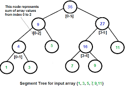

# CSC212 Final Project (Segment Tree)
This project will use a segement tree to predict the probability of certain outcomes to give better judgement on whether the player should hit or stand. A blackjack program and Segment Tree program was created for this project. 

## Introduction
A segment tree is a data structure that uses a linear data structure such as an array. The leaves of this tree are the the elements in order in the array. Each parent node is the sum of two elements. This process is repeated until its reach the root. The root would be the total sum of all of the elements in the array. Segment trees have a time complexitity of O(n log n) Below is a depiction of a simple segment tree.



## Implementation 
Three files are created for this project: SegTree.h, SegTree.cpp and main.cpp. Implementation of the Segment Tree class is what is used to create the different types of probabilites that can help in a player turn. 


## Setup
1. Open your terminal in the proper directory and download the three files.
2. Compile - ```g++ main.cpp SegTree.cpp -o blackjack```.
3. Run the program - ```./blackjack```.
4. The terminal will output the dealers card, your cards, your total count, and probability of the dealer having a higher card than you.
5. It will also tell you the probability of not going over 21 aswell as having a faborable hand (17-21) based on your your total count.
5. Choose hit or stand.
6. Depending on what you choose it will prompt you to hit again or if you won or lost.
7. It will then promt you if you want to continue playing or not.

## Example Execution

